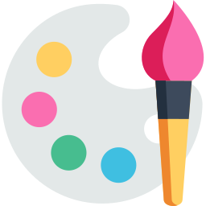
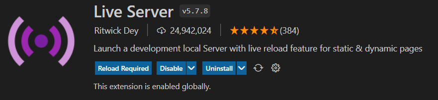

<!-- Improved compatibility of back to top link: See: https://github.com/othneildrew/Best-README-Template/pull/73 -->

<!--
*** Thanks for checking out the Best-README-Template. If you have a suggestion
*** that would make this better, please fork the repo and create a pull request
*** or simply open an issue with the tag "enhancement".
*** Don't forget to give the project a star!
*** Thanks again! Now go create something AMAZING! :D
-->

<!-- PROJECT SHIELDS -->
<!--
*** I'm using markdown "reference style" links for readability.
*** Reference links are enclosed in brackets [ ] instead of parentheses ( ).
*** See the bottom of this document for the declaration of the reference variables
*** for contributors-url, forks-url, etc. This is an optional, concise syntax you may use.
*** https://www.markdownguide.org/basic-syntax/#reference-style-links
-->
[![Contributors][contributors-shield]][contributors-url]
[![Forks][forks-shield]][forks-url]
[![Stargazers][stars-shield]][stars-url]
[![Issues][issues-shield]][issues-url]
[![MIT License][license-shield]][license-url]
[![LinkedIn][linkedin-shield]][linkedin-url]

<!-- PROJECT LOGO -->
 

  

<h3 align="center">Let's Draw</h3>

  

    A free, open-source drawing program feat. HTML Canvas, localStorage 🎨
     
    <a href="https://github.com/Prasenjit-3433/Lets-Draw"><strong>Explore the docs »</strong></a>
     
     
    <a href="https://letsdrawjs.netlify.app/">View Demo</a>
    ·
    <a href="https://github.com/Prasenjit-3433/Lets-Draw/issues">Report Bug</a>
    ·
    <a href="https://github.com/Prasenjit-3433/Lets-Draw/issues">Request Feature</a>
  

<!-- TABLE OF CONTENTS -->

  
Table of Contents

  <ol>
    <li>
      <a href="#-about-the-project">About The Project</a>
      <ul>
        <li><a href="#-built-with">Tech Stack</a></li>
      </ul>
    </li>
    <li>
      <a href="#-getting-started">Getting Started</a>
      <ul>
        <li><a href="#prerequisites">Prerequisites</a></li>
        <li><a href="#installation">Installation</a></li>
      </ul>
    </li>
    <li><a href="#%EF%B8%8F-implementation">Implementation</a></li>
    <li><a href="#-features">Features</a></li>
    <li><a href="#-contributing">Contributing</a></li>
    <li><a href="#-license">License</a></li>
    <li><a href="#-contact">Contact</a></li>
    <li><a href="#%EF%B8%8F-references">References</a></li>
  </ol>

<!-- ABOUT THE PROJECT -->
## 🙋 About The Project

<!--   -->

  

Let's Draw is a free picture editing/drawing program inspired by MS Paint. Its goal is to provide users with a simple but robust MS Paint alternative with the ability to draw and manipulate pictures on Linux, Mac, and Windows. The program offers a decent basic toolset for creating drawings.

The program enables the user to draw with their free hand on a blank canvas or on a picture in a color of their choice, with plenty of different brush sizes. It supports all major functions, such as coloring, picture editing, special effects, Ps layers, and so on.

You can take advantage of advanced capabilities, like saving your work in browser's localStorage so that even if you leave the application, still your data remains safe, download your work in form of jpeg image. 🔥

(<a href="#readme-top">back to top</a>)

### 🛠 Built With

* 
* 
* 

(<a href="#readme-top">back to top</a>)

<!-- GETTING STARTED -->
## 🚀 Getting Started

This is an example of how you may start on setting up your project locally.
To get a local copy up and running follow these simple example steps.

### Prerequisites

This is an example of how to list things you need to use the software and how to install them.
* Live Server Extension
  

### Installation

1. First of all install `Live Server` extension by `Ritwick Dey`.
2. Once the extension was installed, then `right-click` on `index.html` and select `Open with Live Server`.
3. It'll open a new tab in browser & start serving the Paint App. Enjoy!.

(<a href="#readme-top">back to top</a>)

<!-- USAGE EXAMPLES -->
## 🏗️ Implementation

* First of all, we need to gather all `functional requirements` of a paint type application. A paint application can be broken down into five components: `brush`, `color picker`, `eraser`, `options to save your work`, and most important the `canvas` itself.

* Then break the UI into small `Ui Components` & start building indivisual components.

Ui Components:

<ol>
<li>
    

      
Custom Slider, JSColor, Mobile Message

      <ul>
        <li>First of all, we created a navbar of height 50px which take 100% of width of the viewport. Then placed all necessary fontawesome icons inside it and styled them accordingly.</li>
        <li>Next, our color picker slider looks so ugly, so customized it.</li>
        <li>Also the color picker for brush, canvas background doesn't look well on all operating systems. So it needs to customised. In this case, I'm using 3rd party library called jscolor. I modified some code in the jscolor.js file of that library & styled the input elements as it needs to be.</li>
        <li>This application is not compatible to work on any mobile devices. So it shows a warning message to user to use larger screen.</li>
      </ul>
    

  </li>
  </li>
  <li>
    

      
Canvas API

      <ul>
        <li>First of all, we need to setup our canvas in javascript. In order to do that, create a canvas element and then call getContent() with param `2d` on it to get Canvas Context which allows us to work with the canvas.</li>
        <li>In JavaScript, I set the `width`, `height` of canvas to window.innerWidth, window.innerHeight - 50 (as 50px is the height of the toolbar at top).</li>
        <li>To change background color, it listenes for `change` event to get the new value & then re-create the canvas again.</li>
        <li>Now for the brush, it listenes for `change` event on the input element of type `range` .i.e. on custom slider to get the user's choosen size of the brush. Also the color for brush is stored in global var so that it can be used on other places as well.</li>
        <li>Last one is eraser, an erase is nothing just a brush with the same color of the background.</li>
      </ul>
    

    </li>
  <li>
    

      
Drawing on Canvas

      <ul>
        <li>Normally 1 unit in the grid corresponds to 1 pixel on the canvas.  The origin of this grid is positioned in the top left corner at coordinate (0,0). All elements are placed relative to this origin. So the position of the top left corner of the blue square becomes x pixels from the left and y pixels from the top, at coordinate (x,y).</li>
        <li>Drawing paths: Now let's look at paths. A path is a list of points, connected by segments of lines that can be of different shapes, curved or not, of different width and of different color. To make shapes using paths, we take some extra steps:</li>
        <li>1. First, you create the path.</li>
        <li>2. Then you use drawing commands to draw into the path</li>
        <li>3. Once the path has been created, you can stroke or fill the path to render it.</li>
        <li>The brush will listen for 'MouseEvent' on the canvas element. Then the drawing will happen when 'onmousemove' event occus along with between 'onmousedown' and 'onmouseup' events.</li>
      </ul>
    

  </li>
  <li>
  

      
Storing, Fetching drawing data from localStorage

    <ul>
        <li>On the fire of 'onmousemove' event, we store the coordinate of current position in (x, y) form, current brush size, current brush color and current brush type like whether it's a brush or an eraser!.</li>
        <li>It stores all the above said informations in a global array. This allows to repaint the canvas automatically, otherwise on the change of background color, all the drawings get lost.</li>
        <li>Now on the click on `arrow-down` icon, it saves that global array into localStorage.</li>
        <li>Similarly, on the click on `arrow-up` icon, it fetches that global array from localStorage and re-constructs the canvas again.</li>
        <li>Last but not least, to download user's drawing, on click on `download` icon, it makes canvas to a DataURL by calling toDataURL on canvas with type 'image/jpeg' and jpeg quality to  '1.0' .i.e. full quality.</li>
      </ul>
    

  </li>
</ol>

_For more information, visit necessary reference [Link](#%EF%B8%8F-references)_

(<a href="#readme-top">back to top</a>)

<!-- Features -->
## 💎 Features

- [ ] **Simple & Clean UI**: The setup provides very simple & clean UI which involves all the minimal necessary tools a user needs to start painting, no other unnecessary tools included that makes the UI difficult to use.
- [ ] **Fast**: This application is built with vanilla JavaScript, no such heavy lifting framework or library like React, Angular involved. This makes Ui very fast in term of performance.
- [ ] **Local Storage**: The setup uses browser's Local Storage to store or fetch your work. Since there is no database server involved, the process of saving user's work or loading back his previous work from localStorage is very fast.

See the [open issues](https://github.com/Prasenjit-3433/Lets-Draw/issues) for a full list of proposed features (and known issues).

(<a href="#readme-top">back to top</a>)

<!-- CONTRIBUTING -->
## 🤝 Contributing

Contributions are what make the open source community such an amazing place to learn, inspire, and create. Any contributions you make are **greatly appreciated**.

If you have a suggestion that would make this better, please fork the repo and create a pull request. You can also simply open an issue with the tag "enhancement".
Don't forget to give the project a star! Thanks again!

1. Fork the Project
2. Create your Feature Branch (`git checkout -b feature/AmazingFeature`)
3. Commit your Changes (`git commit -m 'Add some AmazingFeature'`)
4. Push to the Branch (`git push origin feature/AmazingFeature`)
5. Open a Pull Request

(<a href="#readme-top">back to top</a>)

<!-- LICENSE -->
## 📜 License

Distributed under the MIT License. See `LICENSE.txt` for more information.

(<a href="#readme-top">back to top</a>)

<!-- CONTACT -->
## 📮 Contact

Prasenjit Sutradhar - [@twitter_handle](https://twitter.com/twitter_handle) - prasenjitsutradhar3433@gmail.com

Project Link: [https://github.com/Prasenjit-3433/Lets-Draw](https://github.com/Prasenjit-3433/Lets-Draw)

(<a href="#readme-top">back to top</a>)

<!-- references -->
## ✌️ References

* [Fontawesome Icons](https://fontawesome.com/icons?d=gallery&m=free)
* [w3schools - How TO Range Sliders](https://www.w3schools.com/howto/howto_js_rangeslider.asp)
* [jscolor - Custom Color Picker](https://jscolor.com/)
* [MDN - Canvas API](https://developer.mozilla.org/en-US/docs/Web/API/Canvas_API/Tutorial/Basic_usage)
* [MDN - Drawing Shapes](https://developer.mozilla.org/en-US/docs/Web/API/Canvas_API/Tutorial/Drawing_shapes)
* [MDN - Canvas to DataURL](https://developer.mozilla.org/en-US/docs/Web/API/HTMLCanvasElement/toDataURL)

(<a href="#readme-top">back to top</a>)

<!-- MARKDOWN LINKS & IMAGES -->
<!-- https://www.markdownguide.org/basic-syntax/#reference-style-links -->
[contributors-shield]: https://img.shields.io/github/contributors/Prasenjit-3433/Lets-Draw.svg?style=for-the-badge
[contributors-url]: https://github.com/Prasenjit-3433/Lets-Draw/graphs/contributors
[forks-shield]: https://img.shields.io/github/forks/Prasenjit-3433/Lets-Draw.svg?style=for-the-badge
[forks-url]: https://github.com/Prasenjit-3433/Lets-Draw/network/members
[stars-shield]: https://img.shields.io/github/stars/Prasenjit-3433/Lets-Draw.svg?style=for-the-badge
[stars-url]: https://github.com/Prasenjit-3433/Lets-Draw/stargazers
[issues-shield]: https://img.shields.io/github/issues/Prasenjit-3433/Lets-Draw.svg?style=for-the-badge
[issues-url]: https://github.com/Prasenjit-3433/Lets-Draw/issues
[license-shield]: https://img.shields.io/github/license/Prasenjit-3433/Lets-Draw.svg?style=for-the-badge
[license-url]: https://github.com/Prasenjit-3433/Lets-Draw/blob/main/LICENSE.txt
[linkedin-shield]: https://img.shields.io/badge/-LinkedIn-black.svg?style=for-the-badge&logo=linkedin&colorB=555
[linkedin-url]: https://in.linkedin.com/
[product-screenshot]: images/screenshot.png
[HTML5]: https://img.shields.io/badge/HTML5-f06529?style=for-the-badge&logo=html5&logoColor=white
[HTML-url]: https://developer.mozilla.org/en-US/docs/Glossary/HTML5
[Css]: https://img.shields.io/badge/CSS3-2965f1?style=for-the-badge&logo=CSS3&logoColor=white
[Css-url]: https://developer.mozilla.org/en-US/docs/Web/CSS
[Js]: https://img.shields.io/badge/JavaScript-F0DB4F?style=for-the-badge&logo=JavaScript&logoColor=323330
[Js-url]: https://www.javascript.com/
