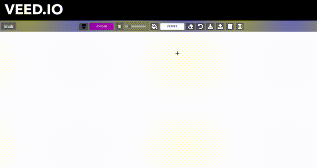

<!-- Improved compatibility of back to top link: See: https://github.com/othneildrew/Best-README-Template/pull/73 -->

<!--
*** Thanks for checking out the Best-README-Template. If you have a suggestion
*** that would make this better, please fork the repo and create a pull request
*** or simply open an issue with the tag "enhancement".
*** Don't forget to give the project a star!
*** Thanks again! Now go create something AMAZING! :D
-->

<!-- PROJECT SHIELDS -->
<!--
*** I'm using markdown "reference style" links for readability.
*** Reference links are enclosed in brackets [ ] instead of parentheses ( ).
*** See the bottom of this document for the declaration of the reference variables
*** for contributors-url, forks-url, etc. This is an optional, concise syntax you may use.
*** https://www.markdownguide.org/basic-syntax/#reference-style-links
-->
[![Contributors][contributors-shield]][contributors-url]
[![Forks][forks-shield]][forks-url]
[![Stargazers][stars-shield]][stars-url]
[![Issues][issues-shield]][issues-url]
[![MIT License][license-shield]][license-url]
[![LinkedIn][linkedin-shield]][linkedin-url]

<!-- PROJECT LOGO -->
 

  

<h3 align="center">Kanban Board</h3>

  

    A web-based, Kanban-style, project management tool feat. Drag and Drop API, localStorage 😎
     
    <a href="https://github.com/Prasenjit-3433/Drag-and-Drop"><strong>Explore the docs »</strong></a>
     
     
    <a href="https://kanbanboardjs.netlify.app/">View Demo</a>
    ·
    <a href="https://github.com/Prasenjit-3433/Drag-and-Drop/issues">Report Bug</a>
    ·
    <a href="https://github.com/Prasenjit-3433/Drag-and-Drop/issues">Request Feature</a>
  

<!-- TABLE OF CONTENTS -->

  
Table of Contents

  <ol>
    <li>
      <a href="#-about-the-project">About The Project</a>
      <ul>
        <li><a href="#-built-with">Tech Stack</a></li>
      </ul>
    </li>
    <li>
      <a href="#-getting-started">Getting Started</a>
      <ul>
        <li><a href="#prerequisites">Prerequisites</a></li>
        <li><a href="#installation">Installation</a></li>
      </ul>
    </li>
    <li><a href="#%EF%B8%8F-implementation">Implementation</a></li>
    <li><a href="#-features">Features</a></li>
    <li><a href="#-contributing">Contributing</a></li>
    <li><a href="#-license">License</a></li>
    <li><a href="#-contact">Contact</a></li>
    <li><a href="#%EF%B8%8F-references">References</a></li>
  </ol>

<!-- ABOUT THE PROJECT -->
## 🙋 About The Project

<!--   -->

  

"Kanban" is the Japanese word for "visual signal". If you work in services or technology, your work is often times invisible and intangible. A kanban board is an agile project management tool designed to help visualize work, limit work-in-progress, and maximize efficiency (or flow). It can help both `agile` and `DevOps` teams establish order in their daily work. Kanban boards use cards, columns, and continuous improvement to help technology and service teams commit to the right amount of work, and get it done!

Kanban has come a long way from its origins in lean manufacturing thanks to a small but mighty group of kanban enthusiasts. David Anderson’s work defining the kanban method helped bring kanban into the software and services space, and Personal Kanban, by Jim Benson and Tonianne DeMaria, helped expand the applications of kanban to places you wouldn’t believe. 🔥

(<a href="#readme-top">back to top</a>)

### 🛠 Built With

* 
* 
* 

(<a href="#readme-top">back to top</a>)

<!-- GETTING STARTED -->
## 🚀 Getting Started

This is an example of how you may start on setting up your project locally.
To get a local copy up and running follow these simple example steps.

### Prerequisites

This is an example of how to list things you need to use the software and how to install them.
* Live Server Extension
  

### Installation

1. First of all install `Live Server` extension by `Ritwick Dey`.
2. Once the extension was installed, then `right-click` on `index.html` and select `Open with Live Server`.
3. It'll open a new tab in browser & start serving the Kanban Board. Enjoy!.

(<a href="#readme-top">back to top</a>)

<!-- USAGE EXAMPLES -->
## 🏗️ Implementation

* First of all, we need to gather all `functional requirements` of the Kanban Board. kanban boards can be broken down into five components: `Visual signals`, `columns`, `work-in-progress` limits, a `commitment point`, and a `delivery point`.

 

* Then break the UI into small `Ui Components` & start building indivisual components.

Ui Components:

<ol>
<li>
    

      
Custom Slider, JSColor, Mobile Message

      <ul>
        <li>First of all, we created a navbar of height 50px which take 100% of width of the viewport. Then placed all necessary fontawesome icons inside it and styled them accordingly.</li>
        <li>Next, our color picker slider looks so ugly, so customized it. [Read more](https://www.w3schools.com/howto/howto_js_rangeslider.asp)</li>
        <li>Also the color picker for brush, canvas background doesn't look well on all operating systems. So it needs to customised. In this case, I'm using 3rd party library called [jscolor](https://jscolor.com/). I modified some code in the jscolor.js file of that library & styled the input elements as it needs to be.</li>
        <li>This application is not compatible to work on any mobile devices. So it shows a warning message to user to use larger screen.</li>
      </ul>
    

  </li>
  </li>
  <li>
    

      
Canvas API

      <ul>
        <li>First of all, we need to setup our canvas in javascript. In order to do that, create a canvas element and then call getContent() with param `2d` on it to get Canvas Context which allows us to work with the canvas.</li>
        <li>In JavaScript, I set the `width`, `height` of canvas to window.innerWidth, window.innerHeight - 50 (as 50px is the height of the toolbar at top).</li>
        <li>To change background color, it listenes for `change` event to get the new value & then re-create the canvas again.</li>
        <li>Now for the brush, it listenes for `change` event on the input element of type `range` .i.e. on custom slider to get the user's choosen size of the brush. Also the color for brush is stored in global var so that it can be used on other places as well.</li>
        <li>Last one is eraser, an erase is nothing just a brush with the same color of the background.</li>
      </ul>
    

    </li>
  <li>
    

      
Drawing on Canvas

      <ul>
        <li>Normally 1 unit in the grid corresponds to 1 pixel on the canvas.  The origin of this grid is positioned in the top left corner at coordinate (0,0). All elements are placed relative to this origin. So the position of the top left corner of the blue square becomes x pixels from the left and y pixels from the top, at coordinate (x,y).</li>
        <li>Drawing paths: Now let's look at paths. A path is a list of points, connected by segments of lines that can be of different shapes, curved or not, of different width and of different color. To make shapes using paths, we take some extra steps:</li>
        <li>1. First, you create the path.</li>
        <li>2. Then you use [drawing commands](https://developer.mozilla.org/en-US/docs/Web/API/CanvasRenderingContext2D#paths) to draw into the path</li>
        <li>3. Once the path has been created, you can stroke or fill the path to render it. [Read more](https://developer.mozilla.org/en-US/docs/Web/API/Canvas_API/Tutorial/Drawing_shapes#drawing_paths)</li>
        <li>The brush will listen for [MouseEvent](https://www.w3schools.com/jsref/obj_mouseevent.asp) on the canvas element. Then the drawing will happen when [onmousemove](https://www.w3schools.com/jsref/event_onmousemove.asp) event occus along with between [onmousedown](https://www.w3schools.com/jsref/event_onmousedown.asp) and [onmouseup](https://www.w3schools.com/jsref/event_onmouseup.asp) events.</li>
      </ul>
    

  </li>
  <li>
  

      
Add, Update, Delete an Item

    <ul>
        <li>On the click on `Add Item` button, an inputBox will appear and `add Item` button get vanished by `Save Item` button.</li>
        <li>Once an user entered his message and press `Save Item`, the message is pushed into localArrays, transferred into localStorage and DOM get updated!.</li>
        <li>At the time of creating item in the column, we also added contentEditable = true. So that later on, when user click on an item, he is able to edit/delete it.</li>
        <li>Now when an user click into an item, modified it and then leves the element, then `focusout` event get fired. The focusout event fires when an element is about to lose focus. On the fire of this event, the item is checked for if it does has text or not. If not, then remove it from the corresponding localArray & update the DOM. If it has text, then the current string in the corresponding localArray overwritten by new one & update the DOM.</li>
        <li>But in the above process, drag-drop functionlity get broken Because when an user click on an item, it's opening to be edited, meaning that the item's text content is in flux. As a result, when user drag it, because the text content is in flux and not saved, it does't have ability to copy it over to another column because it doesn't know what's its own value is.</li>
        <li>In order to fix this, we need to make sure that an item can be updated only if it is not being dragged. So we create a global variable to keep track whether an item is being dragged or not. At start of drag function, we set it to `true` and at the end of drop function set it back to false.</li>
      </ul>
    

  </li>
</ol>

_For more information, visit necessary reference [Link](#%EF%B8%8F-references)_

(<a href="#readme-top">back to top</a>)

<!-- Features -->
## 💎 Features

- [ ] **Flexibility**: Digital Kanban boards allow teams that do not share a physical office space to use kanban boards remotely and asynchronously. The setup involves just a few clicks to create digital lists, which represent the stages of your kanban process, on a board view that your whole team can access and manage.
- [ ] **Drag and Drop**: Once can move a task from one stage to another stage by just dragging and dropping the card.
- [ ] **Local Storage**: The setup uses browser's Local Storage to store the digital for faster data fetching. Even if the browser or tab get closed, all the data remain safe!. So that on the next page load, the board gets back to its previous state.

See the [open issues](https://github.com/Prasenjit-3433/Drag-and-Drop/issues) for a full list of proposed features (and known issues).

(<a href="#readme-top">back to top</a>)

<!-- CONTRIBUTING -->
## 🤝 Contributing

Contributions are what make the open source community such an amazing place to learn, inspire, and create. Any contributions you make are **greatly appreciated**.

If you have a suggestion that would make this better, please fork the repo and create a pull request. You can also simply open an issue with the tag "enhancement".
Don't forget to give the project a star! Thanks again!

1. Fork the Project
2. Create your Feature Branch (`git checkout -b feature/AmazingFeature`)
3. Commit your Changes (`git commit -m 'Add some AmazingFeature'`)
4. Push to the Branch (`git push origin feature/AmazingFeature`)
5. Open a Pull Request

(<a href="#readme-top">back to top</a>)

<!-- LICENSE -->
## 📜 License

Distributed under the MIT License. See `LICENSE.txt` for more information.

(<a href="#readme-top">back to top</a>)

<!-- CONTACT -->
## 📮 Contact

Prasenjit Sutradhar - [@twitter_handle](https://twitter.com/twitter_handle) - prasenjitsutradhar3433@gmail.com

Project Link: [https://github.com/Prasenjit-3433/Drag-and-Drop](https://github.com/Prasenjit-3433/Drag-and-Drop)

(<a href="#readme-top">back to top</a>)

<!-- references -->
## ✌️ References

* [Fontawesome Icons](https://fontawesome.com/icons?d=gallery&m=free)
* [w3schools - How TO Range Sliders](https://www.w3schools.com/howto/howto_js_rangeslider.asp)
* [jscolor - Custom Color Picker](https://jscolor.com/)
* [MDN - Canvas API](https://developer.mozilla.org/en-US/docs/Web/API/Canvas_API/Tutorial/Basic_usage)
* [MDN - Drawing Shapes](https://developer.mozilla.org/en-US/docs/Web/API/Canvas_API/Tutorial/Drawing_shapes)

(<a href="#readme-top">back to top</a>)

<!-- MARKDOWN LINKS & IMAGES -->
<!-- https://www.markdownguide.org/basic-syntax/#reference-style-links -->
[contributors-shield]: https://img.shields.io/github/contributors/Prasenjit-3433/Drag-and-Drop.svg?style=for-the-badge
[contributors-url]: https://github.com/Prasenjit-3433/Drag-and-Drop/graphs/contributors
[forks-shield]: https://img.shields.io/github/forks/Prasenjit-3433/Drag-and-Drop.svg?style=for-the-badge
[forks-url]: https://github.com/Prasenjit-3433/Drag-and-Drop/network/members
[stars-shield]: https://img.shields.io/github/stars/Prasenjit-3433/Drag-and-Drop.svg?style=for-the-badge
[stars-url]: https://github.com/Prasenjit-3433/Drag-and-Drop/stargazers
[issues-shield]: https://img.shields.io/github/issues/Prasenjit-3433/Drag-and-Drop.svg?style=for-the-badge
[issues-url]: https://github.com/Prasenjit-3433/Drag-and-Drop/issues
[license-shield]: https://img.shields.io/github/license/Prasenjit-3433/Drag-and-Drop.svg?style=for-the-badge
[license-url]: https://github.com/Prasenjit-3433/Drag-and-Drop/blob/main/LICENSE.txt
[linkedin-shield]: https://img.shields.io/badge/-LinkedIn-black.svg?style=for-the-badge&logo=linkedin&colorB=555
[linkedin-url]: https://in.linkedin.com/
[product-screenshot]: images/screenshot.png
[HTML5]: https://img.shields.io/badge/HTML5-f06529?style=for-the-badge&logo=html5&logoColor=white
[HTML-url]: https://developer.mozilla.org/en-US/docs/Glossary/HTML5
[Css]: https://img.shields.io/badge/CSS3-2965f1?style=for-the-badge&logo=CSS3&logoColor=white
[Css-url]: https://developer.mozilla.org/en-US/docs/Web/CSS
[Js]: https://img.shields.io/badge/JavaScript-F0DB4F?style=for-the-badge&logo=JavaScript&logoColor=323330
[Js-url]: https://www.javascript.com/
